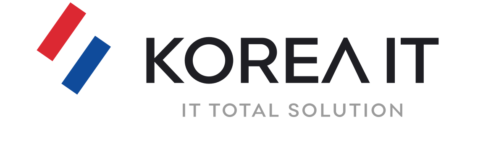

## 1. 프로젝트 개요

이 저장소는 주식회사 코리아아이티 KOREA IT 공식 홈페이지 소스입니다.

홈페이지의 목적은 다음과 같습니다.

* KOREA IT의 회사 정체성 소개
* 회사소개, 서비스, 기술자산, 문의 정보 제공
* 전자공고 게시판 운영
* 닷홈 웹호스팅 배포용 정적/PHP 혼합 홈페이지 관리

## 2. 현재 홈페이지 구조

현재 홈페이지는 다음 구조를 기준으로 운영합니다.

```text
/
├─ index.html
├─ about/
│  └─ index.html
├─ services/
│  ├─ index.html
│  ├─ it-operations/
│  │  └─ index.html
│  ├─ business-system/
│  │  └─ index.html
│  ├─ data-automation/
│  │  └─ index.html
│  ├─ security-backup/
│  │  └─ index.html
│  ├─ ai-automation/
│  │  └─ index.html
│  └─ web-hosting/
│     └─ index.html
├─ assets-page/
│  └─ index.html
├─ contact/
│  └─ index.html
├─ notice/
│  ├─ index.php
│  ├─ view.php
│  ├─ admin.php
│  ├─ save.php
│  ├─ data/
│  │  └─ notices.json
│  └─ uploads/
├─ css/
│  └─ style.css
├─ js/
│  └─ main.js
└─ assets/
```

## 3. 주요 페이지 설명

### 메인 페이지

```text
index.html
```

홈페이지의 첫 화면입니다. KOREA IT의 핵심 메시지와 공고 제목, 문의 동선을 제공합니다.

### 회사소개

```text
about/index.html
```

KOREA IT의 연혁과 회사 방향을 설명합니다. HISTORY 내용은 메인 페이지가 아니라 회사소개 페이지에서 관리합니다.

### 서비스

```text
services/index.html
```

KOREA IT의 주요 서비스를 안내합니다. 각 서비스는 별도 상세 페이지로 분리합니다.

서비스 상세 페이지 예시:

```text
services/it-operations/index.html
services/business-system/index.html
services/data-automation/index.html
services/security-backup/index.html
services/ai-automation/index.html
services/web-hosting/index.html
```

### 기술자산

```text
assets-page/index.html
```

Universal Excel Parser, OpenClaw 등 KOREA IT의 기술자산을 설명합니다.

### 공고

```text
notice/index.php
```

회사 전자공고 목록 페이지입니다.

공고 관련 파일:

```text
notice/index.php
notice/view.php
notice/admin.php
notice/save.php
notice/data/notices.json
notice/uploads/
```

### 문의

```text
contact/index.html
```

회사 연락처, 이메일, 주소 정보를 관리합니다.

## 4. assets 폴더 사용 원칙

`assets/` 폴더에는 KOREA IT 공식 로고 및 이미지 자산이 들어 있습니다.

중요 원칙:

* assets 폴더의 파일은 임의로 삭제하지 않습니다.
* 로고 파일을 새로 만들지 않습니다.
* 기존 로고를 placeholder 파일로 덮어쓰지 않습니다.
* 로고 색상, 비율, 형태를 임의로 변경하지 않습니다.
* HTML/CSS에서는 기존 assets 파일을 참조만 합니다.

로고 사용 예시:

루트 페이지:

```html

```

1단계 하위 페이지:

```html

```

2단계 하위 페이지:

```html

```

단, 실제 파일명은 현재 assets 폴더의 파일명을 기준으로 합니다.

## 5. 로컬 확인 방법

VSCode에서 프로젝트 폴더를 열고 Live Server로 확인합니다.

```text
index.html 우클릭
→ Open with Live Server
```

확인 주소 예시:

```text
http://127.0.0.1:5500/index.html
```

단, PHP 기반 공고 게시판 기능은 Live Server에서 정상 작동하지 않을 수 있습니다. 공고 등록, 저장, 첨부파일 업로드 기능은 닷홈 서버에 업로드 후 테스트합니다.

## 6. 닷홈 업로드 위치

닷홈 웹호스팅 업로드 위치는 다음과 같습니다.

```text
/hosting/kfh007/html
```

업로드 시 프로젝트 폴더 자체를 올리지 말고, 프로젝트 안의 파일과 폴더를 `/html` 안에 직접 업로드합니다.

올바른 구조:

```text
/hosting/kfh007/html/index.html
/hosting/kfh007/html/about/
/hosting/kfh007/html/services/
/hosting/kfh007/html/notice/
/hosting/kfh007/html/css/
/hosting/kfh007/html/js/
/hosting/kfh007/html/assets/
```

잘못된 구조:

```text
/hosting/kfh007/html/koreait-homepage/index.html
```

## 7. 공고 게시판 테스트 방법

닷홈 업로드 후 아래 주소에서 확인합니다.

공고 목록:

```text
https://kfh007.dothome.co.kr/notice/
```

공고 관리자:

```text
https://kfh007.dothome.co.kr/notice/admin.php
```

테스트 절차:

1. `notice/admin.php` 접속
2. 관리자 비밀번호 입력
3. 공고 제목 입력
4. 공고 내용 입력
5. 필요 시 첨부파일 업로드
6. 저장
7. `notice/index.php`에서 공고 목록 확인
8. 제목 클릭 후 `notice/view.php` 상세 페이지 확인
9. 첨부파일 다운로드 확인

## 8. 작업 기록

### 현재 정리된 방향

* 메인 페이지는 간결하게 유지
* SERVICES, ERP, HISTORY는 메인에서 제거
* HISTORY는 회사소개 페이지에서 관리
* 서비스 설명은 서비스 페이지와 서비스 상세 페이지에서 관리
* ERP 관련 내용은 서비스 상세 페이지 중 업무 시스템 / ERP·MIS 페이지에서 관리
* 메인 Notice 영역은 공고 제목만 표시
* 공고 제목 클릭 시 공고 상세 페이지로 이동
* 일본어 페이지는 현재 운영하지 않음

## 9. 수정 시 주의사항

홈페이지 수정 시 다음 원칙을 지킵니다.

* 메인 페이지를 다시 길게 만들지 않습니다.
* Hero 영역에 불필요한 키워드 나열을 넣지 않습니다.
* assets 폴더의 로고 파일을 수정하지 않습니다.
* 공고 게시판은 `notice/index.php`를 대표 목록으로 사용합니다.
* `notice/index.html`은 만들지 않습니다.
* README.md에는 주요 변경사항을 기록합니다.
